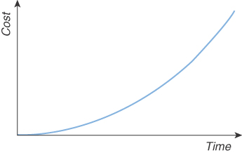
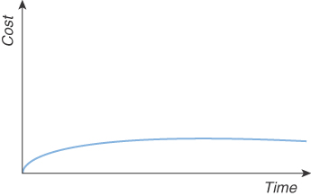
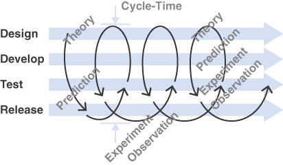

**迭代**被定义为“一个过程，在这个过程中，一系列操作的重复产生越来越接近于期望结果的结果。”1
从根本上说，迭代是一个驱动学习的过程。迭代使我们能够学习、反应和适应我们所学到的东西。没有迭代以及与收集反馈密切相关的活动，就没有机会持续学习。从根本上说，迭代允许我们犯错误并纠正它们，或者取得进步并增强它们。
这个定义也提醒我们，迭代允许我们逐步接近某个目标。它的真正力量在于，即使我们不知道如何实现目标，它也能让我们做到这一点。只要我们有办法判断我们是离目标更近还是更远，我们甚至可以随机迭代并仍然实现我们的目标。我们可以放弃让我们走得更远的台阶，而更喜欢让我们更近的台阶。这就是进化的本质。它也是现代机器学习 (ML) 工作原理的核心。

1. 资料来源：韦氏词典，https://www.merriam-webster.com/dictionary/iteration

> **敏捷革命**
>
> 至少从 1960 年代开始，团队就在实践更多迭代、反馈驱动的开发方法。然而，在科罗拉多州的一个滑雪胜地举行了一次著名的思想家和实践者的会议之后，敏捷宣言概述了一个共同的哲学，该哲学支持这些更灵活、以学习为中心的策略，而不是当时常见的重量级流程。
> Agile Manifesto2 是一个简单的文档。它是9行文字和12条原则，但它产生了很大的影响。
> 在此之前，有一些安静的反对者的传统观点是，如果您在软件中做任何“严肃”的事情，那么您需要以生产为中心的瀑布开发技术。
> 敏捷思维需要一段时间才能突破，但现在它，而不是瀑布，是主要的方法，至少在思维方面。
> 然而，即使在技术层面，大多数组织仍然在组织层面上由瀑布思维在文化上主导。
> 然而，敏捷思维建立在比之前的想法更加稳定的基础之上。从本质上讲，最能体现敏捷社区的想法（也许是理想）的短语是“检查和适应”。
> 这种观念的变化是显着的，但还不够。为什么这一步很重要？因为它代表了将软件开发视为学习练习而不是生产问题的方向上的一步。瀑布过程对于某些类型的生产问题可能有效，但它们极不适合涉及探索的问题。
> 这一步很重要，因为尽管 Fred Brooks 的 10x 步骤在技术、工具或流程方面似乎不可用，但有些方法效率很低，以至于完全有可能将它们提高一个数量级。瀑布，当应用于软件开发时，就是这样的候选者。
> 瀑布式思维源于这样一种假设：“只要我们足够努力地思考/工作，我们就能在一开始就把事情做好。”
> 敏捷思维颠倒了这一点。它始于假设我们将不可避免地出错。 “我们不会理解用户想要什么”，“我们不会马上得到设计”，“我们不知道我们是否已经发现了我们编写的代码中的所有错误”，等等和很快。因为他们开始假设他们会犯错，所以敏捷团队的工作方式非常有意地降低了错误的成本。
>
> 2. 敏捷宣言，https://agilemanifesto.org/
> 
> 敏捷思维与科学共享这一理念。从怀疑的角度看待想法并寻求证明想法是错误的，而不是证明它们是正确的（“可证伪性”），是更科学的心态所固有的。
> 这两种思想流派，可预测性与探索性，促进了完全不同、不兼容的项目组织和团队实践方法。
> 基于敏捷思维的假设，我们将处理我们的团队、流程和技术的组织，使我们能够安全地犯错，轻松观察错误，做出改变，并且在理想情况下，下次做得更好。
> 关于 Scrum 与极限编程、持续集成与功能分支、TDD 与熟练的开发人员认真思考或其他任何事情的争论都无关紧要。从本质上讲，任何真正的敏捷过程都是“经验过程控制”的练习。
> 与之前的以生产为中心、基于预测的瀑布方法相比，这明显更适合任何类型的软件开发。

迭代工作在一些基本方式上不同于以更有计划的顺序方法工作。不过，这是一种明显更有效的策略。
对许多读者来说，这似乎很明显，但事实并非如此。软件开发的大部分历史都假设迭代是不必要的，并且所有步骤的详细计划是软件开发早期阶段的目标。
迭代是所有探索性学习的核心，也是任何真正知识获取的基础。

## 迭代工作的实际优势

如果我们将软件工程视为发现和学习的练习，那么迭代必须是其核心。然而，迭代工作的各种其他优势一开始可能并不明显。
或许最重要的想法是，如果我们开始改变我们的工作实践以更加迭代地工作，它会自动缩小我们的关注范围并鼓励我们以较小的批次进行思考，并更认真地对待模块化和关注点分离。这些想法最初是反复工作的自然结果，但最终成为提高我们工作质量的良性循环的一部分。
Scrum 和极限编程 (XP) 的共同想法之一是，我们应该在小的工作单元上工作直到完成。敏捷思维过程是，“软件开发的进展很难衡量，但我们可以衡量完成的功能，所以让我们处理更小的功能，以便我们可以看到它们何时完成。”
批量大小的减少是向前迈出的一大步。但是，当您想知道“完成”需要多长时间时，事情就变得复杂了。这种迭代开发方法不同于更传统的思维方式。例如，在持续交付中，我们的工作是每天多次的小改动都是可发布的。它应该完成到我们可以在任何时候安全可靠地将我们的软件发布到生产中的程度。那么在这种情况下，“完成”到底意味着什么？
每个更改都已完成，因为它是可发布的，因此“完成”的唯一合理衡量标准是它为用户提供了一些价值。这是非常主观的事情。我们如何预测需要多少更改才能向用户表示“价值”？大多数组织所做的是猜测一组组合起来代表“价值”的功能，但如果我可以在我的软件生命周期中的任何时候发布，这是一个有点模糊的概念。
猜测构成“价值”的更改集是有问题的，因为它取决于这样一个假设，即您在开始时了解所需的所有功能，并且可以确定朝着某种“完整性”概念的进展。这是对敏捷运动创始人含义的过度简化，但这是大多数向敏捷规划过渡的传统组织所做的假设。
迭代工作的一个更微妙的优势是我们有一个选择。我们可以迭代我们创建的产品，并根据客户和用户的良好反馈引导它们实现更高价值的结果。这是这种工作方式更有价值的方面之一，而试图采用它的更传统的组织往往忽略了这一点。
然而，无论意图或结果如何，这种基于小批量的方法确实鼓励我们，作为一个行业，减少我们将要处理的功能的大小和复杂性，这是非常重要的一步。

敏捷规划在很大程度上取决于将工作分解成足够小的部分，以便我们可以在单个冲刺或迭代中完成我们的功能。最初，这是作为衡量进展的一种方式来推广的，但它对定期提供关于我们工作质量和适当性的明确反馈产生了更深远的影响。这种变化提高了我们学习的速度。这个设计有用吗？我们的用户喜欢这个功能吗？系统是否足够快？我是否消除了所有错误？我的代码适合工作吗？等等。
在小的、确定的和生产就绪的步骤中迭代工作为我们提供了很好的反馈！

## 迭代作为防御性设计策略

反复工作鼓励我们采取防御性的设计方法。 （我们在第三部分更深入地讨论了这个细节。）
我的朋友丹·诺斯 (Dan North) 首先向我展示了一个关于敏捷思维基础的有趣观点。 Dan 将瀑布思维和敏捷思维之间的区别描述为经济学中的一个问题。瀑布式思维是基于随着时间的推移变化变得更加昂贵的假设而发布的。它经典地讨论了变更成本模型，如图 4.1 所示。

图 4.1 变革的经典成本

这种世界观是有问题的。这意味着如果这个模型是正确的，唯一明智的解决方案是在项目生命周期的早期做出最重要的决定。这样做的困难在于，在项目生命周期的早期，我们对它的了解最少。因此，我们正在根据不明智的猜测做出项目生命周期中的关键决策，无论我们在这一点上多么努力地通知他们。
软件开发永远不会以“......每一项工作都被完全理解”开始，无论我们在开始工作之前多么努力地分析事物。鉴于我们从来没有从“明确定义的输入集”开始，无论我们如何努力地计划，定义的过程模型或瀑布方法都会落在第一个障碍上。让软件开发适应这种不合适的模式是不可能的。
意外、误解和错误在软件开发中很正常，因为它是一种探索和发现的练习，因此我们需要专注于学习以保护自己免受我们在此过程中不可避免地犯下的错误。
Dan North 的另一种观点是：考虑到经典的“变革成本”模型显然对我们没有帮助，那有什么帮助呢？如果我们可以使变更成本曲线变平，会好多少？ （见图 4.2。）
如果我们可以改变主意，发现新想法，发现错误并修复它们，并且每次发生的成本都大致相同，那会怎样？如果变更成本曲线是平坦的怎么办？
它会给我们自由去发现新事物并从我们的发现中受益。这将使我们能够采用一种方法，使我们能够不断提高我们对产品的理解、代码和用户体验。

图 4.2 变革的敏捷成本

那么，要实现平坦的变更成本曲线需要什么？
我们不能在不创造任何东西的情况下花费大量时间在分析和设计上，因为这意味着有更多的时间没有学习真正有效的方法。 所以我们需要压缩东西。 我们需要迭代工作。 我们需要做足够多的分析、设计、编码、测试和发布，将我们的想法交到我们的客户和用户手中，这样我们才能看到真正有效的方法。 我们需要对此进行反思，然后根据学习情况调整我们接下来要做的事情以利用它。
这是持续交付的核心思想之一（见图 4.3）。

图 4.3 持续交付中的迭代

## 计划的诱惑
提倡瀑布思维的人是善意的。他们认为这是最好的前进方式。我们的行业花了几十年的时间试图使这种方法奏效，但事实并非如此。
这里的困难在于瀑布方法听起来非常明智：“在开始之前仔细考虑”和“仔细计划你将要做的事情，然后努力执行计划。”根据我们工业时代的经验，这些想法很有意义。如果您有一个明确定义的过程，这种定义的过程控制方法非常有效。
在制作实物时，生产工程的问题和放大的问题往往比设计的问题更重要。但是，即使在物理事物的制造中，这种情况现在也在发生变化。随着制造变得更加灵活，一些制造工厂可以改变方向，那么即使在制造中这种僵化的过程也受到了挑战和颠覆。然而，这种“生产线”思维主导了大多数组织至少一个世纪，我们在某种程度上被编程为以这种方式思考问题。
要认识到你所采用的范式从根本上是错误的，需要一个艰难的智力飞跃。当整个世界都认为这种范式是正确的时，情况就更是如此。

> **流程战争**
>
> 如果语言、形式主义或图表没有 10 倍的改进，我们还能在哪里寻找？
> 我们组织自己的方式以及我们对学习和发现的技能和技术的方法似乎是我们学科固有的，似乎是一条富有成效的探索途径。
> 在软件开发的早期，早期的程序员通常在数学、科学或工程方面受过高等教育。他们以个人或小组的形式开发系统。这些人是一个新领域的探索者，和大多数探索者一样，他们带来了他们的经验和偏见。软件开发的早期方法通常是非常数学化的。
> 随着计算机革命的开始和软件开发变得越来越普遍，需求迅速超过供应。我们需要更快地生产更多、更好的软件！所以我们开始研究其他行业，试图复制他们如何应对大规模高效工作。
> 这就是我们犯下可怕错误的地方，即误解了软件开发的基本性质以及制造和生产中误用的技术。我们招募了大量的开发人员，并试图创建相当于大规模生产线的软件。
> 这样做的人并不愚蠢，但他们确实犯了一个大错误。问题是多方面的。软件是复杂的东西，它的创建过程与传统的“生产问题”没有真正的关系，这似乎是大多数人的想法。
> 使我们的学科产业化的最初尝试是痛苦的、普遍的，并且非常具有破坏性。它导致了许多软件的创建，但其中大部分都是有问题的。它缓慢、低效、迟到，不能满足用户的需求，并且极难维护。在 1980 年代和 1990 年代，软件开发作为一门学科爆炸式增长，许多大型组织中应用到它的过程的复杂性也是如此。
> 尽管该学科的领先思想家已经很好地理解了这个问题的许多方面，但这些失败仍然存在。
> 1970 年 Fred Brooks 所著的 Mythical Man Month 再次详细描述了这些问题以及如何避免这些问题。很可能，作为软件开发人员，您在工作中几乎每天都要面对。尽管事实上它是基于布鲁克斯在 1960 年代后期使用当时相对粗糙的技术和工具为 IBM 360 大型计算机开发操作系统的经验。布鲁克斯再次触及比语言、工具或技术更重要、更基础的东西。
> 在此期间，许多团队制作了出色的软件，通常完全忽略了当时关于如何规划和管理项目的“智慧”。这些团队中有一些共同的主题。他们往往很小。开发人员接近他们软件的用户。他们迅速尝试想法并在事情没有按预期工作时改变策略。在此期间，这是革命性的东西——事实上，革命性如此之高，以至于许多这些团队基本上都以隐身模式运作，他们工作的组织在这种模式下应用了重量级的流程，从而减慢了他们的速度。
> 到 1990 年代后期，为了应对这些重量级流程，一些人开始尝试定义更有效的策略。几种不同的软件开发竞争方法越来越受欢迎。 Crystal、Scrum、极限编程和其他几个试图捕捉这种非常不同的方法。这些观点被正式化为敏捷宣言。

在软件领域，敏捷革命推翻了这一规范，但即使在今天，许多甚至大多数组织的核心仍然是计划/瀑布驱动。
除了难以识别问题之外，坚持瀑布式规划的组织仍然存在一些一厢情愿的想法。如果一个组织能够：

- 正确识别用户需求
- 如果满足这些需求，则准确评估对组织的价值
- 准确估计满足这些需求需要多少成本
- 对收益是否大于成本做出理性决定
- 制定准确的计划
- 无偏差地执行计划
- 最后数钱

问题在于，无论是在业务层面还是技术层面，这都是不可信的。现实世界，以及其中的软件开发，并不是这样工作的。
行业数据表明，对于世界上最好的软件公司，他们三分之二的想法产生零或负值。3 我们很难猜测用户想要什么。即使我们询问用户，他们也不知道自己想要什么。最有效的方法是迭代。接受我们的一些甚至很多想法是错误的，并且以一种允许我们尽可能快速、廉价和有效地尝试它们的方式工作。
众所周知，评估一个想法的商业价值也非常困难。 IBM 总裁 Thomas J. Watson 有一句名言，他曾预言世界对计算机的需求有朝一日会高达 5 个！
这不是技术问题；这是一个人为限制的问题。为了取得进步，我们必须抓住机会，做出猜测，愿意承担风险。不过，我们非常不擅长猜测。因此，为了最有效地取得进展，我们必须组织自己，这样我们的猜测就不会毁了我们。我们需要更谨慎地工作，更具防守性。我们需要小步前进，限制我们猜测的范围或爆炸半径，并从中学习。我们需要迭代工作！
一旦我们有了想要执行的想法，我们就需要找到一种方法来决定何时停止。我们如何停止一个坏主意？一旦我们决定这个想法值得冒险尝试，我们如何以一种方式限制爆炸半径，这意味着我们不会因为一个糟糕的想法而失去一切？我们需要能够尽快发现坏主意。如果我们可以通过思考来消除坏主意，那太好了。然而，许多想法并没有那么糟糕。成功是一个模糊的概念。一个想法甚至可能是一个好主意，但可能会因时机不当或执行不力而失望。
我们需要找到一种以最低成本尝试我们的想法的方法，以便如果它不好，我们可以以相对较低的成本快速找到它。 2012 年由麦肯锡集团与牛津大学联合开展的一项软件项目调查发现，17% 的大型项目（预算超过 1500 万美元）进展得非常糟糕，以至于它们威胁到了承担这些项目的公司的存在。我们如何识别这些坏主意？如果我们一步一步地工作，对进展或其他方面做出真正的反应，并不断验证和审查我们的想法，我们就能以最低的投资最快地看到事情开始与我们的希望和计划不同时。如果我们以小步迭代工作，任何一步出错的成本都不可避免地更低；因此，这种风险的水平降低了。
在“无限的开始”中，大卫·多伊奇描述了范围有限的想法与范围有限的想法之间的深刻区别。计划的、瀑布式的、定义过程的方法与迭代的、探索性的、实验性的方法的比较是两种根本不同的想法之间的比较。定义的过程控制模型 4 需要“定义的过程”。根据定义，这在范围上是有限的。在这种方法的极限下，在某种程度上，人脑有能力保存整个过程的细节。我们可以聪明地使用抽象等概念和模块化等概念来隐藏一些细节，但最终以某种计划定义端到端的流程需要我们涵盖将发生的一切。这是解决问题的固有有限方法。我们只能解决我们事先可以理解的问题。

3. 来源：“大规模在线控制实验”，https://stanford.io/2LdjvmC

4. Ken Schwaber 将瀑布描述为“定义的过程控制模型”，他定义为：“定义的过程控制模型要求完全理解每一项工作。给定一组明确定义的输入，每次都会生成相同的输出。可以启动定义的流程并允许其运行直到完成，每次都具有相同的结果。” Schwaber 将其与敏捷方法所代表的“经验过程控制模型”进行了比较。请参阅 https://bit.ly/2UiaZdS。

迭代方法是非常不同的。当我们几乎一无所知但仍然取得有益进展时，我们就可以开始了。我们可以从系统的一些简单易懂的方面开始。使用它来探索我们的团队应该如何处理它，尝试我们对系统架构的初步想法，尝试一些我们认为可能有前途的技术，等等。这些事情都不一定是固定的。即使我们发现该技术是一个坏主意并且我们对架构的第一个概念是错误的，我们仍然取得了进展。我们现在比以前更了解。这是一个本质上是开放的、无限的过程。只要我们有某种“适应功能”，一种判断我们是朝着目标前进还是远离目标的方式，我们就可以永远保持这种状态，提炼、增强和改进我们的理解、我们的想法、我们的想法。技能，以及我们的产品。如果我们决定有更好的目标，我们甚至可以决定改变我们的“适应度函数”。

> 无限的开始
>
> 物理学家大卫·多伊奇在其拓展思维的著作《无限的开始》中将科学和启蒙描述为对“好的解释”的追求，并解释了人类历史上的各种思想如何代表“无限的开始”，使我们能够应对任何可以想象的这些很好的解释的相关应用。
> 一个很好的例子是字母和象形文字之间的区别。
> 人类是从象形文字开始的，中文和日文的文字仍然采用这种形式（对于某些写作风格）。这些看起来很漂亮，但它们有一个严重的缺陷。如果你遇到一个对你来说很陌生的词，你会听到它说出来；你不能写下来，除非你让别人告诉你怎么写。象形文字的书写形式并不是真正的增量；你必须知道每个单词的正确符号。 （汉字大约有 50,000 个字符。）
> 字母表的工作方式完全不同。字母编码声音，而不是文字。您可以拼写任何单词，可能拼错了，任何人都可以（至少在语音上）理解您所写的内容。
> 即使您以前从未听说过这个词或看过它写过的词，也是如此。
> 同样，您可以阅读您不知道的单词。您甚至可以阅读您不理解或不知道如何发音的单词。你不能用象形文字做这些事情。这意味着字母书写方法的范围是无限的，而象形文字则不是。一种是表达想法的可扩展方法；另一个不是。
> 这种无限触及或范围的想法适用于敏捷开发方法，而不适用于基于瀑布的方法。
> 瀑布方法是连续的。在进入下一阶段之前，您必须回答您所在阶段的问题。这意味着无论我们多么聪明，在某些时候，系统作为一个整体的复杂性都必须超出人类的理解范围。
> 人的心智能力是有限的，但我们的理解能力不一定如此。我们可以通过使用我们已经进化和开发的技术来解决我们大脑的生理极限。我们可以抽象事物，我们可以划分（模块化）我们的思维，从而将我们的理解扩展到一个显着的程度。
> 软件开发的敏捷方法积极鼓励我们开始着手解决更小的问题。它鼓励我们在知道所有问题的答案之前就开始工作。这种方法使我们能够取得进步，有时可能是在次优甚至糟糕的方向上，但尽管如此，在每一步之后，我们都会学到新的东西。
> 这使我们能够完善我们的思维，确定下一个小步骤，然后迈出那一步。敏捷开发是一种无限的、无限的方法，因为我们在从已知和理解的位置前进之前先处理问题的一小部分。这是一种更加有机、进化、无限制的解决问题的方法。
> 这是一个深刻的差异，并解释了为什么敏捷思维代表了我们在解决理想情况下越来越难的问题方面取得进展的能力中向前迈出的重要和重要的一步。
> 这并不意味着敏捷思维是完美的或最终的答案。相反，它是朝着更好的性能方向迈出的重要的、重要的、有利的一步。

该计划的诱惑是虚假的。这不是更勤奋、更可控、更专业的方法。相反，它更受限制，更多地基于预感和猜测，并且实际上只能适用于小型、简单、易于理解、定义明确的系统。
这带来的影响是显着的。这意味着我们必须，正如 Kent Beck 在其开创性著作《极限编程解释》的副标题中所说的那样，“拥抱变化”！
当我们还不知道答案以及当我们不知道将涉及多少工作时，我们必须学会有信心准确地开始工作。这对某些人和某些组织来说是令人不安的，但这仅与大部分人类经验的现实相同。当一家企业开始新的冒险时，他们真的不知道什么时候会成功，甚至不知道它是否会成功。他们不知道有多少人会喜欢他们的想法，以及他们是否愿意为这些想法买单。
即使对于像开车旅行这样平凡的事情，您也无法确定需要多长时间，或者您选择的路线在您开始后是否仍然是最佳路线。如今，我们拥有出色的工具，例如带有无线电连接的卫星导航系统，它们不仅可以在开始时规划我们的路线，还可以使用交通信息迭代更新图片，使我们能够“检查并适应”不断变化的旅程环境。
计划和执行的迭代方法使我们能够始终掌握我们实际所处情况的最新图景，而不是该情况的某种预测性、理论性、始终不准确的版本。它使我们能够随着沿途发生的变化而学习、做出反应和适应。迭代工作是应对不断变化的情况的唯一有效策略。

## 迭代工作的实用性
那么，我们可以做些什么来以这种方式工作？首先是小批量工作。我们需要缩小每次更改的范围，并在更小的步骤中进行更改；一般来说，越小越好。这使我们能够更频繁地尝试我们的技术、想法和技术。
小批量工作也意味着我们限制了假设需要保持的时间范围。宇宙有一个更小的时间窗口，它可以在其中侵入我们的工作，所以事情不太可能以破坏性的方式改变。最后，如果我们迈出一小步，即使一小步因环境变化或只是我们的误解而失效，也不会损失更少的工作。所以，小步骤真的很重要。
这种想法在敏捷团队中的明显体现是迭代或冲刺的想法。敏捷学科提倡在一个小的、固定的时间段内工作完成、生产就绪的代码的想法。这会产生多种有益的效果，即本章所述的效果。然而，这只是迭代工作的一种粗粒度化身。
在完全不同的范围内，您可以将持续集成 (CI) 和测试驱动开发 (TDD) 的实践视为本质上的迭代过程。
在 CI 中，我们将频繁地提交我们的更改，每天多次。这意味着每个更改都需要是原子的，即使它所贡献的功能尚未完成。这改变了我们处理工作的方式，但让我们有更多机会学习和了解我们的代码是否仍然与其他人的代码一起工作。
TDD 通常由促成它的实践来描述：红色、绿色、重构。

- 红色：编写一个测试，运行它，然后看到它失败。
- 绿色：编写足够的代码来使测试通过，运行它，并看到它通过。
- 重构：修改代码和测试，使其清晰、有表现力、优雅、更通用。在每次微小更改后运行测试并查看它是否通过。

这是一种深度细粒度的迭代方法。它鼓励对编写代码的基本技术细节采用更加迭代的方法。
例如，在我自己的编码中，我几乎总是通过一系列多阶段的微小重构步骤引入新的类、变量、函数和参数，并经常通过运行测试来检查我的代码是否继续工作。
这是以非常精细的分辨率迭代工作。这意味着我的代码是正确的并且可以在更多时间工作，这意味着每一步都更安全。
在过程中的每一点，我都可以轻松地重新评估和改变我的想法以及我的设计和代码的方向。我保持我的选择！
这些特性就是为什么迭代工作如此有价值，并且是软件开发工程学科如此重要的基础实践。

## 概括

迭代是一个重要的想法，也是我们朝着更可控的学习、发现以及更好的软件和软件产品方法迈进的能力的基础。然而，世上没有免费的午餐。如果我们想迭代地工作，我们必须以多种方式改变我们的工作方式以促进它。
迭代工作会影响我们构建的系统的设计、我们如何组织我们的工作以及我们如何构建我们工作的组织。迭代的思想深深地融入了本书背后的思想和我在这里展示的软件工程模型中。所有的想法都深深地相互关联，有时，弄清楚迭代在哪里结束和反馈从哪里开始可能会很棘手。