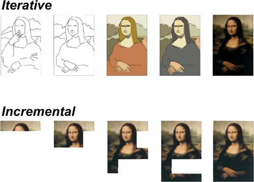

增量主义的定义如下：“增量设计与任何模块化设计应用程序直接相关，如果改进组件以确保更好的性能，可以自由替换其中的组件。”1
渐进式工作是逐步建立价值。 简而言之，这是关于利用我们系统的模块化或组件化。
如果迭代工作是通过一系列迭代来改进和改进某些东西，那么增量工作是关于构建一个系统，理想情况下是一点一点地发布它。 这在图 6.1 中得到了很好的体现，取自 User Story Mapping [Patton].2

*迭代与增量*

1. 来源：维基百科，https://en.wikipedia.org/wiki/Continuous_design

2. 我第一次看到“迭代”和“增量”方法之间的这种比较是在 Jeff Patton 的《用户故事映射》一书中。 参见 https://bit.ly/3s9jvY6。

要创建复杂的系统，我们需要两种方法。 增量方法使我们能够分解工作并逐步（增量地）交付价值，更快地获得价值并以更小、更简单的步骤交付价值。

## 模块化的重要性
模块化是一个重要的想法。它在技术发展中很重要，但并不特定于信息技术。当石器时代的工匠用木柄制作燧石斧时，这是一个模块化系统。如果你打破了手柄，你可以保留斧头并制作一个新手柄。如果你弄坏了斧头，你可以把一个新的斧头绑在你旧的、可靠的把手上。
随着机器变得越来越复杂，模块化的重要性和价值也随之增长。除了 20 世纪的最后几年，当飞机设计师想要做一些新的事情时，他们将他们的工作分为两个主要模块：动力装置（发动机）和机身。很大一部分航空进步是作为一种技术接力赛进行的。如果您想尝试一种新发动机，首先要在经过验证的机身上进行尝试。如果您想尝试新机身，请使用经过验证的发电厂。
当阿波罗计划于 1960 年代启动时，其目标是将人类送上月球，早期的飞跃之一是创建一个称为月球轨道交会 (LOR) 的任务剖面。 LOR 意味着航天器将被分成一系列模块，每个模块都专注于挑战的特定部分。有土星五号，它的工作是将所有其他东西送入地球轨道，然后最后阶段是让另一个特定任务的模块将航天器的其余组件从地球推进到月球。
阿波罗飞船的其余部分由四个主要模块组成：
服务模块的工作是将所有其他东西从地球运送到月球，然后再返回。

指挥舱是宇航员的主要栖息地；不过，它的主要工作是将宇航员从地球轨道返回地面。

月球游览模块 (LEM) 由其他两个模块组成：下降和上升模块。下降舱将宇航员从月球轨道带到月球表面。

上升模块将宇航员送回月球轨道，在那里他们与指挥和服务模块会合、对接，然后返回地球。

这种模块化有很多优点。这意味着可以构建每个组件以专注于问题的一个部分，并且在其设计中需要更少的妥协。它允许不同的团队——在这种情况下是完全不同的公司——在很大程度上独立于其他模块的每个模块上工作。只要不同的小组就模块如何相互连接达成一致，他们就可以不受约束地解决他们模块的问题。每个模块都可以更轻，因为例如，月球模块不需要携带返回地球一直到月球表面的手段。
尽管将任何阿波罗航天器称为简单是一种延伸，但每个模块都可以比设计用于处理整个问题的更大部分更简单。
我希望这种转移能让您思考这与软件的关系。尽管这些复杂的机器都不是简单的，但它们在满足需求方面是极简主义的。
这确实是基于组件的设计方法的哲学，例如微服务，或者实际上是任何面向服务的设计。
将问题分成几部分，旨在解决问题的单个部分。这种方法有很多优点。系统的每个组件都更简单，更专注于手头的任务。每个组件都更容易测试，部署速度更快，有时甚至可以独立于其他组件进行部署。一旦你达到这一点，而不是之前，你就真正进入了微服务领域。
然而，微服务并不是我们可以在任何软件系统中实现模块化并从中受益的唯一方法。这真的是一个认真对待设计的问题。
采用模块化方法迫使您考虑系统模块之间的界限并认真对待它们。这些界限很重要；它们代表了系统中耦合的关键点之一，关注它们之间信息交换的协议可以对隔离工作和增加灵活性的难易程度产生重大影响。我将在后面的章节中更详细地探讨这些想法。

## 组织增量主义
模块化带来的巨大好处之一是隔离；一个模块的内部细节对其他模块是隐藏的，并且与其他模块无关。出于技术原因，这很重要，但出于组织原因，这一点更为重要。
模块化方法使团队能够更独立地工作。他们每个人都可以在不需要团队之间协调或至少以最少的协调的情况下逐步向前迈进。这种自由使完全接受它的组织能够以前所未有的速度前进和创新。
除了渐进式技术变革能力的价值之外，这种方法还使组织能够自由地采用渐进式方法来进行文化和组织变革。
许多组织都在努力实现其工作实践的有效变革。这种“转变”是出了名的困难。进行此类更改的主要障碍始终是您如何在整个组织中传播解决方案。有两个障碍使这种变化的传播变得困难。第一个是解释和激励人们做出改变，第二个是克服限制其采用的组织或程序障碍。
实施变革的最常见方法似乎是尝试使整个组织的流程标准化。 “流程图”和“业务转型”是管理咨询公司的大生意。问题是所有组织，当然是那些参与创造性工作的组织，都依赖于人类的创造力。如果我们可以将流程“标准化”为一系列步骤，我们就可以实现自动化并消除成本高昂且容易出错的人员。您有多少次使用自动电话过滤系统并进入一些没有与您的查询匹配的选项或只是转储呼叫的菜单？这是因为有些事情并不容易分解成简单的步骤，任何编写过计算机程序的人都会证明这一点。
当我们讨论软件开发时，我们远不能从这项工作中消除人类的创造力。因此，为了实现人类的创造力，我们需要在为创造自由构建我们的工作的流程和政策中留出空间。软件开发中高绩效团队的定义特征之一是他们能够取得进步和改变想法，而无需征得其小团队以外的任何人或团体的许可。 3
让我们把它分开一点。让我们从“小团队”开始。虽然我们现在有更多的数据来支持这个断言 4，但人们早就知道小团队优于大团队。弗雷德·布鲁克斯 (Fred Brooks) 在他的《神话人物月》一书中写道：
结论很简单：如果一个 200 人的项目有 25 名最能干、最有经验的程序员，那么解雇 175 名人员，让这些管理人员重新编程。

如今，大多数敏捷实践者会认为一个 25 人的团队是一个大团队。目前的想法是，最佳团队规模是八人或更少。
由于各种原因，小团队很重要，但他们以小的、渐进的步骤取得进展的能力是重要的。要进行组织变革，最有效的策略是创建许多独立的小型团队，并让他们自由进行自己的变革。这一进展可以而且仍然应该是结构化的。它应该在某种程度上受到限制，允许独立的团队朝着大致相似的方向前进，旨在实现更大规模的组织愿景，但这仍然是一种从根本上比大多数大型组织的传统组织结构更加分散的方法。公司。
大多数组织需要进行的关键转型是让人员和团队拥有更大的自主权，以提供高质量、创造性的工作。分布式的、增量的变化是关键。
模块化组织比更传统的软件开发组织结构更灵活、更具可扩展性和效率。

## 增量主义的工具
我的五项学习原则和我管理复杂性的五项原则是紧密相连的。很难在不提及其他人的情况下谈论其中任何一个。
3. Accelerate Book 描述了采用更严格的开发方法的团队如何比没有采用更严格的开发方法的团队在新工作上花费“多 44% 的时间”。请参阅 https://amzn.to/2YYf5Z8。

4. Nicole Forsgren、Jez Humble 和 Gene Kim 在他们的 Accelerate: The Science of Lean Software & DevOps 一书中描述了高绩效团队的特征。请参阅 https://amzn.to/3g0Lvup。

实现增量主义的最深刻的工具是反馈和实验，但我们也需要关注模块化和关注点分离。
然而，除了这些更深层次的原则之外，还有哪些不那么抽象的想法可以帮助我们实现一种更渐进的变革方法？我们需要做什么才能让我们逐步工作？
增量主义和模块化密切相关。如果我们想要渐进式地进行更改，我们必须能够在进行更改的同时限制其对其他领域的影响。努力改进我们系统的模块化是一个好主意，那么我们该怎么做呢？
如果我的代码是一个很大的意大利面条球并且我在一个地方进行了更改，我可能会无意中影响到代码的另一部分。有三个重要的技术可以让我更安全地进行这样的更改。
我可以构建我的系统以限制更改的范围。通过设计模块化且具有良好关注点分离的系统，我可以将更改的影响限制在我直接关注的代码区域之外。
我可以采用允许我以较低风险更改代码的实践和技术。这些更安全的做法中最主要的是重构。这就是在小的、简单的、受控的步骤中进行更改的能力，使我能够安全地改进或至少修改我的代码。
重构技能通常被那些似乎错过了他们的导入的开发人员低估了。如果我们可以以微小的增量进行更改，我们可以对更改的稳定性更有信心。
如果我在我的开发环境中使用重构工具来“提取方法”或“引入参数”，那么我可以确信更改将安全完成，或者我可以购买更好的开发工具。
如果我决定不喜欢结果，也很容易放弃这种微小的变化；我可以迭代地工作，也可以增量地工作。如果我将我的细粒度增量主义与强大的版本控制结合起来，我总是离“安全的地方”只有几步之遥。我总是可以退到一个稳定的位置。
最后，还有测试。测试，特别是自动化测试，让我们可以更有信心地逐步向前推进。
我们将在后面的章节中探讨使用高级自动化测试有效工作的微妙之处，但自动化测试是我们快速做出改变的能力的重要组成部分，有保证。
自动化测试还有一个方面经常被那些没有真正将其作为日常工作实践的普遍部分的人所忽略。这就是测试对设计的影响，特别是我们设计中的模块化和关注点分离。
自动化测试的测试驱动方法要求我们为我们对系统所做的更改创建小型可执行规范。这些小规范中的每一个都描述了开始测试的必要条件，执行被测行为，然后评估结果。
为了管理实现所有这些所需的工作量，如果我们不尝试通过尽可能简单地保持测试并将我们的系统设计为可测试代码来使我们的生活更轻松，我们就会发疯。
由于可测试代码是模块化的，具有良好的关注点分离，自动化测试创建了一个正反馈循环，增强了我们设计更好系统的能力，限制了错误的影响范围，并更安全地进行更改。最终，这三种技术的结合为我们逐步进行更改的能力提供了巨大的进步。

## 限制变化的影响
我们的目标是使用这些技术管理复杂性，因此我们允许自己以更多增量方式开发系统。我们总是倾向于在许多小的步骤中取得进展，而不是一些更大的、风险更大的步骤。
正如我们已经探索过的，如果我们有一个由多个人创建软件的小团队组成的组织，那么如果这些不同的人能够相互独立地取得进展，我们就可以最有效地做到这一点。
只有两种策略是有意义的，而且本质上都是渐进式的。
我们可以将我们的系统分解成更独立的部分，正如我们在本章中已经描述的那样，或者我们可以在通过持续集成集成我们的更改时提高我们收集的反馈的速度和质量。
为了使我们系统的各个部分更加独立，我们可以使用 Ports & Adapters 模式的强大技术。 5
在我们想要解耦的系统的两个组件之间的任何接口点，一个端口，我们定义了一段单独的代码来转换输入和输出，即适配器。这使我们可以更自由地更改适配器背后的代码，而无需强制更改通过此端口与其交互的其他组件。
这段代码是我们逻辑的核心，所以能够在不与其他团队或人员协调的情况下改变这一点是一个巨大的胜利。因此，我们可以安全地在这部分代码中取得渐进式进展，然后处理组件之间商定的信息交换协议中非常棘手且代价高昂的更改。理想情况下，这些更改应该很少发生，因此团队也不会经常破坏彼此的代码。
我们应该总是比我们系统的其他部分更小心地对待这些集成点，这些端口，因为当事情需要在这里改变时，它们会引起更多的痛苦。 Ports & Adapters 方法为我们提供了一种策略，可以在我们的代码中体现“更加关心”。
5. Ports & Adapters 是一种架构模式，旨在产生更松耦合的应用程序组件；它也被称为六边形架构。见 https://bit.ly/3cwH3Sd。

请注意，这与使用的技术无关。与通过 REST API 调用发送的结构化文本相比，端口和适配器对于通过套接字发送的二进制信息同样有用——可能更有用。
管理变更影响的另一个重要且经常被忽视的工具是反馈速度。如果我写了一些破坏你的代码的代码，那么根据我们何时发现我破坏了它，它的重要性会有很大的不同。
如果我们几个月后才发现我打破了某些东西，那么后果可能很严重。如果我们发现问题时我们的代码已经在生产中，那么后果可能非常严重。
另一方面，如果我们在我做出更改后的几分钟内发现，那也没什么大不了的。我可以解决我创建的问题，也许在你注意到之前。这就是持续集成和持续交付解决的问题。
这意味着我们可以使用其中一种或两种策略来限制变化的影响。我们可以设计我们的系统来增强我们做出改变的能力，而不需要强迫他人改变，我们可以优化我们的工作实践，以小的、渐进的步骤进行改变。将这些小的更改提交给某个共享的评估系统，然后优化该评估系统可以为我们提供足够快的反馈，使我们能够对其做出反应并管理我们的更改可能导致的任何问题。

## 增量设计

长期以来，我一直是软件开发敏捷方法的倡导者。部分原因是因为我认为敏捷是一个重要的步骤，一个“无限的开始”步骤，正如我在前一章中描述的那样。这很重要，因为这意味着我们可以在得到所有答案之前开始工作。我们在逐步取得进步的过程中学习，这是本书的核心思想。
这挑战了许多软件开发人员的先入之见。我与之交谈的许多人都在为能够编写代码的想法而苦恼，然后才对他们想要创建的设计有一个详细的了解。
更多的人发现逐步构建复杂系统的想法几乎是不可想象的，但这两个想法都是任何高质量工程方法的核心。
复杂的系统并不是从某个天才创造者的头脑中完全形成的；它们是解决问题、加深我们的理解以及通过有时的辛勤工作探索想法和潜在解决方案的成果。
在某种程度上，这是具有挑战性的，因为它需要我们打开某种心理开关，并且需要一定程度的自信，我们将能够解决我们尚不知道的问题何时最终浮出水面。
我在本书中关于工程的真正含义和软件开发的真正含义的论点旨在为您扭转这种心理转变提供一些帮助（如果您还没有的话）。
面对对未来的无知，自信地取得进步是另一种问题。在某些方面，它有一些更实用的解决方案。
首先，我们需要接受随着我们知识的加深，变化、失误和意外的影响都是不可避免的，无论你是否承认。它只是任何类型的所有复杂创造的现实，特别是在软件开发的背景下，它是野兽的本性。
抱怨“他们”总是把需求弄错是这种情况的一个症状。是的，没有人知道一开始要构建什么。如果他们告诉你他们知道，他们真的不明白问题所在。
接受我们不知道，怀疑我们所知道的，并努力快速学习是从教条到工程的一步。
我们使用关于我们所知道的和逐渐发现的事实，并在每个阶段，根据我们目前认为我们知道的所有东西，将我们的下一步推向未知。这是一种更科学理性的世界观。正如物理学家理查德·费曼 (Richard Feynman) 曾经说过的那样，科学是“一种令人满意的无知哲学”。他还说：
科学家在无知、怀疑和不确定方面有很多经验，我认为这种经验非常重要。

出于多种原因，管理复杂性的技术很重要，但在软件开发的这种背景下，作为一种发现行为，它是至关重要的，因为它们允许我们在“向前迈进”时限制“爆炸半径”一个失误。您可以将其视为防御性设计或防御性编码，但更好的理解方式是增量设计。
我们可以选择以仅仅有组织的步骤序列的方式编写代码，或者更确切地说是没有组织的，就像一个大泥球，没有很好的划分。或者，我们可以编写代码，以便在其发展过程中有效地承认和管理其复杂性。
如果我们采用前者，那么代码的耦合度越高、模块化程度越低、内聚度越低，更改起来就越困难。这就是为什么允许我们管理我不断重复的代码中的复杂性的属性很重要。如果我们在工作中普遍采用每个粒度级别的这些想法，那么我们关闭变革的大门就会减少，并且我们为未来的变革——甚至是意料之外的变革——留出更多的选择余地。这与过度设计和编写应对各种可能性的代码不同。这是组织起来使更改更容易的代码，而不是完成您现在能想到的所有事情的代码。
如果我开始编写一个系统来做一些有用的事情并要求我将结果存储在某个地方，那么我可以做许多开发人员所做的事情，并将做有用事情的代码与执行存储的代码混合在一起。如果我这样做，然后发现我选择的存储解决方案太贵、太有问题或太慢，我唯一的选择就是重写我的所有代码。
如果我将“有用的东西”与“存储”分开，那么我可能会派系地增加代码中的行数。我可能不得不更努力地思考如何建立这种分离，但我已经打开了渐进式工作和渐进式决策的大门。
当我告诉你我认为和我一起工作的人认为我是一名优秀的程序员时，我不认为我是不谦虚的。有时，人们称我为 10x 程序员。如果这些事情是真的，那么它们就不是真的，因为我比其他人更聪明，或者打字速度更快，或者可以使用更好的编程语言。它们是真实的，因为我是循序渐进地工作。我做我在这里描述的。
我对过度设计我的解决方案持谨慎态度。我从来没有打算为我不知道现在需要的东西添加代码。然而，我总是尝试在我的设计中分离关注点，分解系统的不同部分，设计接口，抽象它们所代表的代码中的想法，并隐藏接口另一侧发生的细节。我努力在我的代码中寻找简单、明显的解决方案，但我也有某种内部警告系统，当我的代码开始感觉太复杂、太耦合或模块化不足时，它会发出声音。
我可以列举一些经验法则，例如我不喜欢超过大约十行代码或超过大约四个参数的函数，但这些只是指南。我的目标不是小而简单的代码，而是当我学习新事物时可以改变的代码。我的目标是我可以逐渐增长的代码来实现其功能，因为随着时间的推移，该功能对我来说变得更加清晰。
以允许我们随着理解加深而自由更改代码和改变思想的方式工作是良好工程的基础，也是渐进主义的基础。努力能够以增量方式工作，同时也在努力获得更高质量的系统。如果您的代码难以更改，那么无论它做什么，它都是低质量的。
## 概括

增量工作是构建任何复杂系统的基础。想象这样的系统是从某个或多个专家的头脑中“完全形成”出来的，这是一种错觉；他们没有。它们是工作的结果，也是随着我们不断进步而逐渐积累的知识和理解。组织我们的工作以促进和验证这种学习，使我们能够沿着尚不可见的方向前进。这些想法是使我们能够有效取得进展的核心。