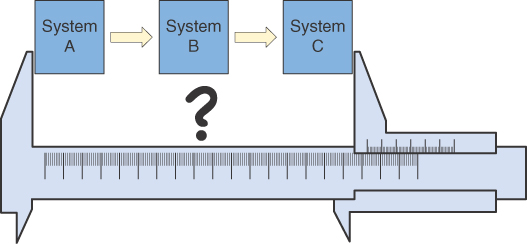

模块化被定义为“系统组件可以分离和重新组合的程度，通常具有使用灵活性和多样性的好处。”1
我一直在编写代码，从我开始学习，即使在用汇编语言编写简单的视频游戏时，模块化在我们的代码设计中也很重要。
然而，我所看到的大部分代码——事实上，我所看到的大部分代码，甚至可能是我编写的一些代码——都远非模块化。在某些时候，这对我来说改变了。我的代码现在总是模块化的；它已成为我风格中根深蒂固的一部分。
模块化对于管理我们创建的系统的复杂性至关重要。现代软件系统是庞大、复杂的，而且往往是真正复杂的东西。大多数现代系统超出了任何人在头脑中掌握所有细节的能力。
为了应对这种复杂性，我们必须将我们构建的系统分成更小、更易于理解的部分——我们可以专注于这些部分，而不必过多担心系统中其他地方发生的事情。
这总是正确的，而且这又是一种以不同粒度运行的分形思想。
作为一个行业，我们已经取得了进步。当我开始我的职业生涯时，计算机及其软件比较简单，但我们必须更加努力地工作才能完成任务。除了提供对文件的访问和允许我们在屏幕上显示文本之外，操作系统几乎没有做任何事情。我们需要做的任何其他事情都必须为每个程序从头开始编写。想打印一些东西吗？您需要了解并编写与特定打印机的低级交互。
1. 资料来源：Merriam-Webster 的词典定义。经许可使用。维基百科，https://en.wikipedia.org/wiki/Modularity。

通过改进我们的操作系统和其他软件的抽象和模块化，我们当然已经取得了进展。
然而，许多系统本身看起来并不模块化。那是因为设计模块化系统是一项艰巨的工作。如果软件开发是关于学习的，那么随着我们的学习，我们的理解会不断发展和变化。所以有可能，甚至可能，我们对哪些模块有意义，哪些模块没有意义的看法也会随着时间的推移而改变。
对我来说，这是软件开发的真正技能。这是最能将专家、他们的技艺大师编写的代码与新手编写的代码区分开来的特性。虽然在我们的设计中实现良好的模块化需要技巧，但我在我看到的很多代码中看到的是人们不仅“做得不好”，而且，他们“根本不尝试它。”许多代码被编写成一个食谱，这意味着在跨越数百甚至数千行代码的方法和函数中收集在一起的线性步骤序列。
试想一下，如果我们在您的代码库中打开一个功能，该功能会拒绝任何包含超过 30 行或 50 或 100 行代码的方法的代码？你的代码会通过这样的测试吗？我知道我在野外看到的大多数代码都不会。
现在当我开始一个软件项目时，我会在持续交付部署管道中建立一个检查，在“提交阶段”，它会做这种测试，并拒绝任何包含超过 20 或 30 行代码的方法的提交。代码。我还拒绝带有超过五个或六个参数的方法签名。这些是任意值，基于我在我工作过的团队中的经验和偏好。我的观点不是推荐这些特定值；相反，像这样的“导轨”对于让我们在设计中保持诚实很重要。无论时间压力如何，编写糟糕的代码永远不会节省时间！

## 模块化的标志
如何判断您的系统是否模块化？从某种意义上说，模块是可以包含在程序中的指令和数据的集合，这是一个简单的级别。这捕获了构成模块的位和字节的“物理”表示。
然而，更实际的是，我们正在寻找将我们的代码分成小隔间的东西。每个隔间都可以重复使用多次，也许在各种上下文中。
模块中的代码足够短，可以很容易地被理解为一个独立的东西，在系统其他部分的上下文之外，即使它需要系统的其他部分就位来做有用的工作。
对变量和函数的范围进行了一些控制，限制了对它们的访问，因此在某种意义上有一个概念，即模块有“外部”和“内部”。有某种接口可以控制访问、管理与其他代码的通信以及处理其他模块。

## 低估好设计的重要性
许多软件开发人员不关注这些想法的原因有几个。作为一个行业，我们低估了软件设计的重要性。我们痴迷于语言和框架。我们对 IDE 与文本编辑器或面向对象编程与函数式编程有争论。然而，这些事情都没有像模块化或关注点分离对我们的输出质量这样的想法那么重要，像基础一样重要。
如果您的代码具有良好的模块化和良好的关注点分离，那么无论编程范式、语言或工具是什么，随着您对问题的了解越多，它会变得更好、更容易处理、更容易测试和更容易修改。正在努力解决。与没有这些属性的代码相比，它在使用上也会更加灵活。
我的印象是，要么我们根本不教授这些技能，要么编程（或程序员）中固有的某些东西使我们忽视了它们的重要性。
显然，模块化设计与了解编程语言的语法是一种不同的技能。如果我们希望达到某种程度的掌握，这是一项需要我们努力的技能，我们可以用一生，但可能永远不会完善它。
不过，这对我来说才是软件开发的真正意义所在。我们如何创建代码和系统，这些代码和系统会随着时间的推移而增长和演变，但如果我们犯了错误，它们会被适当地划分以限制损害？我们如何创建适当抽象的系统，以便我们可以将模块之间的边界视为增强系统的机会，而不是阻止我们更改它们的责任？
这是本书论文中的一个重点。
我曾经教过一门关于测试驱动开发 (TDD) 的课程。当一名课程参加者（我不会称他们为程序员）询问为什么代码不那么复杂时，我试图展示 TDD 如何帮助我们降低设计的复杂性。我承认我很震惊。如果这个人没有看到钝、复杂的代码和清晰、简单的代码之间的影响和价值的差异，那么他们对我们的工作的看法与我不同。我尽力回答他的问题，谈到可维护性的重要性和效率方面的优势，但我不相信我的论点给人留下了深刻的印象。
从根本上说，复杂性增加了软件的拥有成本。这具有直接的经济影响以及更主观的影响：复杂的代码不太好处理！
然而，这里真正的问题是复杂的代码，根据定义，更难以更改。这意味着您在第一次编写时就有机会把它写对。另外，如果我的代码很复杂，那么我可能并不像我认为的那样真正理解它；有更多地方可以隐藏错误。
如果我们努力限制我们编写的代码的复杂性，我们可能会犯错误并有更好的机会纠正它们。因此，要么我们可以押注自己的天才，并假设我们一开始就将一切都完美无缺，要么我们可以更加谨慎地进行。我们首先假设世界上会有一些我们没有想到的事情、误解和变化，这意味着我们可能有一天需要重新审视我们的代码。复杂性成本！
我们对新想法持开放态度，这一点很重要。我们不断质疑我们的假设是很重要的。然而，这并不意味着所有的想法都具有同等的价值。有愚蠢的想法，他们应该被驳回；有伟大的想法，它们应该受到重视。
了解一种语言的语法不足以成为一名“程序员”，更不用说成为一名优秀的程序员了。与设计中的高质量相比，“X 语言中的惯用语”更不重要，也更不重要。了解“API Y”的深奥细节并不能使您成为更好的软件开发人员；你可以随时查找这类问题的答案！
真正的技能——真正区分优秀程序员和糟糕程序员的东西——不是特定于语言或特定于框架的。他们躺在别处。
任何编程语言都只是一种工具。我有幸与一些世界一流的程序员一起工作。这些人将使用他们以前从未使用过的编程语言编写好的代码。他们会用 HTML 和 CSS 或 Unix shell 脚本或 YAML 编写漂亮的代码。我的一位朋友甚至编写了可读的 Perl！
有些想法比用来表达它们的语言更深刻、更深刻。模块化是这些想法之一；如果您的代码不是模块化的，那么它几乎肯定不如模块化的代码好！
## 可测试性的重要性

我是 TDD 的早期采用者，为了响应 Kent Beck 于 1999 年出版的“极限编程解释”一书，我朝着这个方向迈出了第一步。我的团队尝试了 Kent 有趣的想法，并在同年弄错了。尽管如此，我们还是从这种方法中受益匪浅。
TDD 是软件开发实践在我的职业生涯中采取的最重要的步骤之一。令人困惑的是，我如此重视它的原因与我们通常认为的“测试”无关。事实上，我现在认为 Kent Beck 犯了一个错误，包括以实践的名义“测试”，至少从营销的角度来看是这样。不，我不知道他应该叫它什么！
第 5 章描述了我们如何从测试中获得关于设计质量的快速、准确的反馈，以及如何使我们的代码可测试来提高其质量。这是一个非常重要的想法。
除了经验丰富、技术娴熟的程序员的品味之外，还有一些事情可以为我们提供有关设计质量的早期反馈。当我们试图改变它时，我们可能会在几周、几个月或几年后了解到我们的设计是好是坏，但除此之外，没有客观的衡量标准来表明质量，除非，也就是说，我们试图推动我们的设计测试。
如果我们的测试难以编写，则说明我们的设计很差。我们立即收到信号。当我们尝试针对下一个行为增量对其进行改进时，我们会获得有关设计质量的反馈。如果我们遵循 TDD 的红色、绿色、重构规则，这些课程会自动提供给我们。当我们的测试很难编写时，我们的设计就会比它应该的更糟糕。如果我们的测试很容易编写我们的代码，那么我们正在测试的东西不可避免地会展现出我们认为是高质量代码标志的特性。
现在，这并不意味着测试驱动的设计方法会自动创建出色的设计。它不是魔杖。它仍然依赖于设计师的技能和经验。一个伟大的软件开发人员仍然会创造出比一个差劲的更好的结果。从测试中驱动我们的设计是鼓励我们创建可测试的代码和系统，因此，考虑到我们的经验和才能的局限性，可以提高结果。
我们没有任何其他我能想到的技术可以真正做到这一点！如果我们要从工艺转向工程，这个人才放大器是一个重要的工具。
如果我们渴望成为工程师，仅仅建议人们“做得更好”是不够的。我们需要能够指导我们并帮助我们取得更好结果的工具。在我们的系统中努力实现可测试性就是这样一种工具。

## 可测试性设计提高了模块化
让我们回到主题，并在模块化的背景下专门考虑这一点。为实现可测试性而设计如何鼓励更大的模块化？
如果我想在飞机上测试机翼翼型的有效性，我可以建造飞机并飞行。这是一个可怕的想法，即使是制造第一架动力控制飞机的莱特兄弟也意识到行不通。
如果您采用这种相当幼稚的方法，那么您必须先完成所有工作，然后才能学习任何东西。当您尝试以这种方式学习时，您将如何衡量这种翼型与另一种翼型的有效性？再造一架飞机？
即便如此，你如何比较结果？也许当你驾驶第一个原型机和第二个原型机时风更大。也许你的飞行员在第一次飞行时吃的早餐比第二次飞行时要多。也许是气压或温度不同，所以机翼因此产生了不同的升力。也许两者的燃料批次不同，所以发动机产生不同的功率水平。您如何管理所有这些变量？
如果采用整个系统的瀑布方法来解决这个问题，系统的复杂性现在将扩展到涵盖机翼运行的整个环境。
科学测量翼型的方法是控制这些变量并在您的实验中将它们标准化。我们怎样才能降低复杂性，以便我们从实验中得到的信号是清晰的？嗯，我们可以把两架飞机放在一个更可控的环境中，也许像一个大风洞。这将允许更精确地控制机翼上的气流和风。也许我们可以在温度和压力受控的环境中做到这一点。只有通过这种控制，我们才能期望获得更多可重复的结果。
如果我们要沿着这条路开始，我们真的不需要引擎、飞行控制或飞机的其他部分。为什么不制作两个带有翼型的机翼模型，我们想在我们的温度和压力控制风洞中测试和试用它们？
这肯定是一个比飞行更准确的实验，但这仍然需要我们将整个机翼建造两次。为什么不制作每个翼型的小模型？尽可能精确地制作每个模型，使用完全相同的材料和技术，并比较两者。如果我们要走那么远，我们可以在更小的规模上做到这一点，我们需要一个更简单的风洞。
这些小飞机是模块。它们肯定会增加整个平面的行为，但它们专注于问题的特定部分。确实，这样的实验只会给你一个部分真实的画面。飞机的空气动力学比机翼更复杂，但模块化意味着我们可以测量没有它就无法测量的东西，因此部件，模块，肯定比整体更易于测试。
在现实世界中，这就是您进行实验以确定机翼形状和其他事物如何影响升力的方式。
模块化使我们可以更好地控制和更精确地测量我们可以测量的事物。让我们把这个例子移到软件世界。假设您正在处理系统 B，它位于系统 A 的下游和系统 C 的上游（见图 9.1）。

图 9.1 耦合系统

这是在复杂组织中处理大型系统的典型情况。这就提出了一个问题：我们如何测试我们的工作？许多（甚至可能是大多数）面临这个问题的组织都假设必须一起测试所有内容以确保系统可以安全使用。
这种方法有很多问题。首先，如果我们只在这个尺度上进行测量，我们就会面临“测试整架飞机”的问题。整个系统如此复杂，以至于我们缺乏精确性、可重复性、控制性和对我们收集的任何结果的真正含义的清晰可见性。
我们无法以任何精度评估我们的系统部分，因为上游和下游部分，系统 A 和系统 C，妨碍了我们。由于这个决定，有许多类型的测试根本不可能。如果系统 A 向其发送格式错误的消息，系统 B 会发生什么情况？
这种情况是无法衡量的，而真正的系统 A 已就位发送格式良好的消息。当与系统 C 的通信通道中断时，系统 B 应如何响应？
同样，当真正的 System C 与工作通信就位时，我们无法测试该场景，这会妨碍我们伪造通信错误。
我们收集的结果并没有告诉我们太多。如果测试失败，是因为我们的系统有问题，还是其他系统有问题？也许失败意味着我们有错误的上游或下游系统版本。如果一切正常，是因为我们准备发布了吗？或者是因为我们试图评估的案例太简单了，由于这个大型系统不可测试，他们没有真正找到真正存在的错误？
如果我们测量的是整个复合系统（见图 9.2），那么我们的结果是模糊和混乱的。图 9.2 中相当卡通化的图表说明了一个重要问题：我们需要清楚我们正在测量的是什么，我们需要清楚我们的测量值。如果我们在这个图中进行端到端的测试，那么我们测试的目标是什么？我们希望展示什么？如果我们的目标是证明所有部分协同工作，那么这在某些情况下可能很有用，但是这种测试方式不足以告诉我们系统 B，我们在这种情况下真正负责的系统，真的有效。这些类型的测试仅作为对更好、更彻底、更模块化的测试策略的一个补充、一个小补充才有意义。它们当然不会取代更详细的测试来证明我们系统 B 的正确工作！

图 9.2 测试耦合系统

那么要实现更详细的测试需要什么？好吧，我们需要一个测量点，它是我们整个系统中的一个地方，我们可以在其中插入某种探针，使我们能够可靠地收集我们的测量结果。我在这一系列图表中将这些“测量点”表示为虚构的卡尺。实际上，我们谈论的是能够将测试数据注入我们的被测系统 (SUT)，调用其中的行为，并收集输出以便我们可以解释结果。我知道卡尺有点俗气，但这就是我在考虑测试系统时的心理模型。我要将我的系统插入某种测试装置中，以便我可以对其进行评估。我需要一个测量设备（我的测试用例和测试基础设施），它允许我将探针连接到我的 SUT，以便我可以看到它的行为。
由于我们已经探讨过的原因，我在图 9.2 中的卡尺不是很有帮助，而且因为系统越大越复杂，结果的可变性就越大。我们没有充分控制变量以获得清晰、可重复的结果。
如果您有一套甚至自动化的测试来评估您的软件以确定它是否准备好发布，并且这些测试每次都不会产生相同的结果，那么这些结果到底意味着什么？
如果我们的目标是应用一些工程思维，我们需要认真对待我们的测量。我们需要能够依赖它们，这意味着我们需要它们是确定性的。对于任何给定的测试或评估，在给定相同版本的被测软件时，我应该期望在每次运行时看到相同的结果，无论我运行多少次，以及运行时发生的其他任何事情。
该声明有足够的价值，值得做额外的工作，如有必要，以实现可重复的结果。它不仅会影响我们编写的测试以及我们如何编写它们，而且重要的是，还会影响我们的软件设计，而这正是这种工程方法的真正价值开始显现的地方。
当我们建立我们的金融交易所时，系统是完全确定的，我们可以记录生产输入并在一段时间后重放它们，以使系统在测试环境中进入完全相同的状态。我们并没有设定这个目标。这是我们实现的可测试性和确定性程度的副作用。

> **复杂性和确定性**
>
> 随着被测系统的复杂性增加，我们测量事物的精度会降低。例如，如果我有一个对性能至关重要的软件，我可以将其隔离并将其放入某种测试设备中，这样我就可以创建一系列受控的测试运行。我可以做一些事情，例如丢弃早期运行以消除运行时优化的任何影响，并且我可以运行足够多的执行来将统计技术应用于我收集的数据。如果我足够认真地对待所有这些事情，我的测量可以准确且可重现，精确到微秒，有时甚至是纳秒。
> 在整个系统性能测试中，对于任何显着规模的系统，做同样的事情实际上是不可能的。如果我衡量整个系统的性能，变量就会爆炸。在运行我的代码的计算机上同时进行了哪些其他任务？网络呢？在我的测量过程中，它是否被用于其他任何事情？
> 即使我控制这些事情，锁定网络并访问我的性能测试环境，现代操作系统也是复杂的事情。如果操作系统决定在我的测试运行时进行一些内务处理怎么办？那肯定会扭曲结果，不是吗？
> 随着系统的复杂性和范围的增长，确定性变得更加难以实现。
> 计算机系统中缺乏确定性的真正根本原因是并发性。这可以采取多种形式。时钟滴答增加系统时间是并发的一种形式；操作系统在认为它有一些空闲时间时重新组织您的磁盘是另一回事。然而，在没有并发的情况下，数字系统是确定性的。对于相同的字节和指令序列，我们每次都得到相同的结果。
> 模块化的一个有用驱动因素是隔离并发性，以便每个模块都具有确定性和可靠的可测试性。构建系统，以便按顺序进入模块并且其结果更可预测。以这种方式编写的系统非常适合使用。
> 这似乎是一个相当深奥的点，但在一个系统中，用户观察到的每个行为都是确定性的，就像我所描述的那样，它将是非常可预测和可测试的，没有意外的副作用，至少在我们的测试。
> 大多数系统都不是这样构建的，但如果我们采用以工程为主导的设计方法，它们就可以。

相反，如果我们可以使用卡尺仅测量我们的组件（参见图 9.3），我们可以以更高的准确度和精确度以及更高的可靠性进行测量。 将我的类比扩展到断点，我们也可以衡量问题的其他维度。

图 9.3 测试模块

那么，随着精确度和特异性的提高，需要采取什么措施来进行测量？好吧，我们希望我们的测量点是稳定的，这样我们每次都能从测量中得到相同的结果，所有其他条件都相同。我们希望我们的评估是确定性的。
我们还希望不必每次系统更改时都从头开始重新创建我们的测量点。
明确地说，我在这里描述的是一个稳定的、模块化的接口，用于我们要测试的系统部分。我们由更小的模块组成更大的系统，模块具有明确定义的接口，用于输入和输出。这种架构方法允许我们在这些接口上测量系统。
读到这里，我希望这看起来很明显。问题是很少有现实世界的计算机系统是这样的。
如果我们将测试作为我们工作的基本组成部分，通过自动化测试，我们创建的系统，那么如果我们错误地创建更多模块化系统，我们将被迫做额外的工作。这是分形。从整个企业系统到单个方法、函数和类，所有粒度级别都是如此。
根本不可能以本书假设的方式测试系统，即在某种程度上不是模块化的。我们需要那些“测量点”。我们的测试能力受到模块化的支持和增强，模块化在我们的设计中受到测试的指导而得到鼓励。
这并不一定意味着一组微小的、独立的组件。这同样适用于大型复杂系统。这里的关键是了解有意义的测量范围，并努力使这些测量易于实现并在它们产生的结果方面保持稳定。
当我参与创建金融交易所时，我们将整个企业系统视为一个单一的系统，但我们为每个外部交互建立了清晰、定义明确的集成点，并伪造了这些外部系统。现在我们有了控制权；现在我们可以注入新的帐户注册并收集在实际操作中会发送到银行或票据交换所等的数据。
这允许我们在某些测试中将整个系统视为一个黑匣子，注入数据以使系统进入适当的测试状态，并收集其输出以评估系统的响应。我们将系统与第三方系统交互的每个点以及每个集成点都视为可以插入测试基础架构的测量点。这是可能的，因为我们的整个企业系统从一开始就考虑到了可测试性。
我们的系统也非常模块化和松散耦合。因此，除了从整体上评估系统之外，我们还可以对单个服务级别组件进行更详细的测试。不可避免地，服务中的所有行为也是使用细粒度 TDD 技术为几乎每一行代码开发的。我们还可以独立于其他一切来测试系统行为的一小部分。正如我所说，模块化和可测试性是分形的。
可测试性深深地影响了我们所做的架构选择，随着时间的推移，它不仅对明显的质量衡量标准产生了深远的影响，比如我们能找到多少或多少错误，而且更微妙地，也许更重要的是，对我们系统的架构划分。
从历史上看，作为一个行业，我们低估了甚至忽略了可测试性的重要性，特别是测试优先开发作为一种工具来推动良好的设计，并为我们提供早期、清晰的设计质量反馈。

## 服务和模块化
软件术语中的服务概念相当模糊。例如，没有主流语言直接支持服务的想法，但这种想法仍然非常普遍。软件开发人员会争论什么是好的服务或坏的服务，并构建他们的系统来支持这个概念。
从纯粹的实践角度来看，我们可以将服务视为向其他代码提供某些“服务”并隐藏其如何提供“服务”的细节的代码。这只是“信息隐藏”的概念，如果我们想随着系统的增长管理系统的复杂性，这非常重要（参见第 12 章）。在我们系统的设计中识别“接缝”，系统的其余部分不需要知道也不应该关心这些“接缝”另一侧发生的事情的细节是一个非常好的主意.这真的是设计的精髓。
因此，服务为我们提供了系统中隐藏细节的小隔间的组织理念。这是一个有用的想法。因此，服务当然可以明智地被视为我们系统的一个模块。如果是这种情况，那么这些“接缝”，即服务或模块触及其边界之外的东西的点呢？为软件术语中的“服务”概念提供任何意义的是它代表了一个边界。在这些边界的两侧，已知的和暴露的之间存在差异。
我在较大的代码库中看到的最常见的问题之一是忽略这种差异的结果。通常，表示这些边界的代码与两侧的代码无法区分。我们使用相同类型的方法调用，甚至在这些边界上传递相同的数据结构。在这些点上没有输入验证或输出的组装和抽象。这样的代码库很快就会变成难以改变的混乱局面。
这方面有进步，但只是一小步，在某种程度上，我们迈出了这一步。这就是向 REST API 的转变。
我的部分背景是高性能计算，因此使用文本、XML 或 HTML 作为对服务之间流动的信息进行编码的想法让我有点冷淡；太慢了！但是，它确实强烈鼓励在您的服务或 API 的边缘设置翻译点的想法。您将传入的消息转换为更易于处理的形式以供服务使用，并将服务的输出转换为一些可怕的、大的、缓慢的、基于文本的消息以供输出。 （对不起，我让我的偏见在那里蔓延。）
不过，软件开发人员仍然会犯这个错误。即使在按照这些方式构建的系统中，我仍然看到直接传递 HTML 的代码，并且整个服务都与该 HTML 交互——糟糕！
应更加小心地处理接缝或边界。它们应该是信息的翻译和验证点。服务的入口点应该是一个小防御屏障，限制该服务消费者的最严重滥用。我在这里描述的是单个服务级别的端口和适配器类型的模型。这种方法对于通过标准方法或函数调用进行通信的服务与使用 HTML、XML 或任何其他形式的消息传递的服务一样适用。
这里的基本思想是模块化之一！如果相邻模块的内部工作被暴露，则系统不是模块化的。模块（和服务）之间的通信应该比它们内部的通信更受保护。

## 可部署性和模块化
在我的《持续交付》一书中，Jez Humble 和我描述了一种组织工作的方法，以便我们的软件始终可发布。我们建议（并继续建议）您的工作是使您的软件始终处于可发布状态。实现这种可重复、可靠的软件发布能力的一部分是确保它易于部署。
自从写了《持续交付》这本书后，我现在更加深刻地相信，让我们的软件既可测试又可部署的工作对我们的工作质量有深远的影响。
我之前的书中的核心思想之一是部署管道的思想，这是一种在一端接受提交并在另一端产生“可发布结果”的机制。这是一个关键的想法。部署管道不仅仅是构建或测试步骤的简单工作流；这是一条从提交到生产的机械化路线。
这种解释有一些含义。这意味着构成“可发布性”的一切都在您的部署管道的范围内。如果管道说一切都很好，那么应该没有更多的工作要做，让您轻松发布——什么都没有……没有更多的集成检查、签收或暂存测试。如果管道说它“很好”，那么它“很好走！”
反过来，这对部署管道的合理范围有一些影响。如果它的输出是“可发布的”，它也必须是“可独立部署的”。有效部署管道的范围始终是“可独立部署的软件单元”。
现在这对模块化产生了影响。如果部署管道的输出是可部署的，则意味着管道构成了对我们软件的明确评估。至少在我们关心并认为安全和明智的程度上，确定它已准备好发布。
如果我们要将这个想法推向其合乎逻辑的结论，那么只有两种策略是有意义的。我们可以一起构建、测试和部署构成我们系统的所有东西，或者我们可以单独构建、测试和部署该系统的各个部分。没有半途而废的解决方案。如果我们对部署管道的输出不够信任，并且觉得有必要用其他部署管道的输出测试它生成的结果，那么就会出现问题；我们的部署管道发送给我们的消息现在还不清楚，而且由于我们正在努力成为工程师，这还不够好！
现在我们评估的范围受到了损害。我们什么时候完成？当我们的管道完成或验证管道输出所需的所有其他管道都已运行时，我们是否完成了？如果是后者，那么我们更改的“周期时间”2 也包括其他所有人更改的周期时间，因此我们有一个整体的评估系统。
最可扩展的软件开发方法是分发它。将团队与其产品之间的耦合和依赖降低到每个团队可以独立创建、测试和部署他们的工作而无需参考其他团队的程度。正是这种方法让亚马逊及其著名的“双披萨团队”3 以前所未有的速度增长。
从技术上讲，实现这种独立性的一种方法是认真对待系统的模块化，以至于每个模块在构建、测试和部署方面都独立于其他模块。这就是微服务。它们是如此模块化，以至于我们不需要在发布之前用其他服务来测试它们。如果您一起测试微服务，它们就不是真正的微服务。微服务的部分定义是它们“可独立部署”。
可部署性可以增加模块化的风险。正如我们所见，可部署性定义了部署管道的有效范围。如果我们重视基于快速、有效反馈的高质量工作，那么我们对真正有效的选择真的非常有限。
我们可以选择一起构建、测试和部署构成我们系统的所有东西，并完全消除依赖管理问题（所有东西都存在于一个存储库中），但是我们必须承担起创建足够快的反馈的责任，以允许开发人员做好工作，这可能需要在工程上进行大量投资才能获得足够快地推动任何高质量流程的反馈。
或者，我们可以使每个模块本质上独立于每个其他模块。我们可以分别构建、测试和部署这些东西，而无需一起测试它们。
这意味着我们的构建、测试和部署的范围很小。它们中的每一个都更简单，因此更容易获得快速、高质量的结果。
然而，这有时会导致我们系统中更复杂、更分布式的架构的巨大成本。现在，我们确实不得不非常认真地对待模块化。
我们必须为它设计；我们必须熟练掌握协议设计技术，使模块之间的交互，它们之间信息交换的协议稳定，不允许以强制更改其他模块的方式进行更改。我们可能需要考虑和应用 API 的运行时版本管理等想法。
几乎每个人都希望在这两个极端之间有一个理想的中间地带，但实际上，它并不存在。中间立场是一种软糖，通常比每个人都努力避免的单一方法更慢、更复杂。微服务这种更有组织的分布式方法是我们所知道的扩大软件开发规模的最佳方法，但它不是一种简单的方法，而且是有代价的。
2. 周期时间是衡量开发过程效率的指标。 “从想法到用户手中的有用软件”需要多长时间？在持续交付中，我们使用优化周期时间作为工具，引导我们采用更有效的开发方法。

3. 亚马逊在 CEO 杰夫·贝佐斯 (Jeff Bezos) 的备忘录后进行了著名的重组。贝佐斯在他的备忘录中说：“......任何团队都不应该超过两个比萨饼所能满足的。”

## 不同规模的模块化

模块化在每个尺度上都很重要。在考虑系统级模块时，可部署性是一个有用的工具，但仅凭这一点还不足以创建高质量的代码。对服务有一种现代的关注。
这是一个有用的架构工具，至少在过去的三年里，它一直是我系统设计方法的核心。但是，如果您的设计的模块化就止步于此，您的系统可能仍然很差，难以使用。
如果，正如我所说的，模块化的重要性是帮助我们管理复杂性的工具，那么我们需要将其提升到可读代码的程度。每个类、方法或函数都应该简单易读，并在适当的情况下由较小的、可独立理解的子模块组成。
同样，TDD 有助于鼓励这种细粒度的代码。为了使代码在此分辨率下可测试，依赖注入等技术鼓励代码具有更大的表面积。这严重影响了我们设计的模块化。
在较小的规模上，依赖注入是对我们的代码施加压力的最有效工具，它鼓励我们创建由许多小块组成的系统。依赖项是卡尺，即测量点，我们可以将其注入系统以实现更彻底的可测试结果。同样，确保我们的代码可测试会鼓励真正模块化的设计，从而使代码更易于阅读。
有些人批评这种设计风格。这种批评通常采取的形式是，以这种方式更难理解具有更大表面积的代码。很难通过系统来跟踪控制流。这种批评没有抓住重点。这里的问题是，如果为了测试该代码有必要暴露该表面积，那么这就是代码的表面积。如果它被糟糕的界面设计和缺乏测试所掩盖，那么理解它有多难？这种批评的根源实际上是关于什么是“好的设计”。我建议将我们的设计集中在复杂性管理上是一个有价值的基准，可以定义我们所说的代码“高质量”的含义。
测试如果做得好，会揭示一些重要和真实的东西，比如我们代码的性质、我们的设计的性质，以及我们正在解决的问题的性质，否则这些问题是不容易获得的。因此，它是我们创建更好、更模块化的系统和代码的最重要工具之一。

## 人类系统的模块化
我在第 15 章详细讨论了这种工程思维的影响，但在这方面强调模块化的特殊重要性是有用的。我的大部分职业生涯都花在了大型计算机系统上。在这样的世界里，不断有人问“我们如何扩展？”有时，很少是关于软件的，但大多数情况下，当大组织中的人问这个问题时，他们真正的意思是“我们如何增加更多的人，以便我们可以更快地生产软件？”
真正的答案是，对于任何给定的计算机系统，都存在非常严重的限制。正如弗雷德·布鲁克斯 (Fred Brooks) 所说：
你不能在一个月内和 9 个女人一起生孩子。 4

但是，还有其他选择；你可以在九个月内和九个女人一起生九个孩子，平均每个月生一个孩子。在这一点上，我或弗雷德的类比失效了！
在软件方面，如果不是婴儿，问题在于耦合。只要这些部分真正相互独立，真正解耦，那么我们就可以并行化我们想要的一切。一旦存在耦合，我们可以并行化的程度就会受到限制。集成成本是杀手锏！
我们如何整合来自不同开发流程的工作？如果你和我一样书呆子，这可能是敲响了警钟；这是关于一些非常基本的东西。这是关于信息和并发性。当您拥有独立的信息流时，如果有任何重叠，将它们组合在一起形成一个连贯的整体的成本可能会非常高。并行化事物的最佳方法是以不需要重新整合（九个婴儿）的方式进行。本质上，这是微服务方法。微服务是一种组织可扩展性游戏；它们真的没有任何其他优势，但让我们明确一点，如果可扩展性是您的问题，这是一个很大的优势！
我们知道，仅仅为一个团队增加更多的人并不会使该团队发展得更快。在对 4,000 多个软件项目进行的一项可爱的元数据研究中，比较了 5 人或更少团队和 20 人或更多团队的相对性能（创建 100,000 行代码的时间），5 人团队只比团队多花一周时间9 个月内 20 人。因此，小型团队的人均生产力几乎是大型团队的 4 倍。 5
如果我们需要小团队来高效地创造好的、高质量的工作，那么我们需要想办法严格限制这些小团队之间的耦合。这至少是一个组织战略问题，也是一个技术问题。我们需要模块化组织以及模块化软件。
因此，如果我们希望我们的组织能够扩大规模，秘诀就是建立需要在尽可能低的程度上协调的团队和系统，我们需要将它们解耦。努力维护这种组织模块化很重要，也是真正高性能、可扩展的组织的真正标志之一。
4. 引用 Fred Brooks 在 1970 年代撰写的有影响力且仍然真实的书，The Mythical Man Month

5. 在一项研究中，定量软件管理 (QSM) 还发现，较大的团队在其代码中产生的缺陷要多 5 倍。请参阅 https://bit.ly/3lI93oe。

## 概括

当我们对我们的软件在未来应该如何工作没有全知的看法时，模块化是我们取得进步的能力的基石。在没有模块化的情况下，我们当然可以创建简单的软件来解决现在摆在我们面前的问题。但是，如果不以在软件各部分之间提供一些隔离层的方式工作，我们继续添加新想法和发展我们的软件的能力将迅速降低到在某些现实世界中没有前进的地步根本没有进步。这是我们防御复杂性所需的工具集合中的第一个。
模块化作为一种设计理念是分形的。我们的编程语言支持的不仅仅是“模块”，无论它们的形式如何。它比这更复杂也更有用。它的核心思想是，我们必须保留在一个地方更改代码和系统的能力，而不必担心这些更改对其他地方的影响。
这让我们开始思考这个问题的其他方面，因此模块化与我们在管理系统复杂性时需要考虑的其他想法密切相关——比如抽象、关注点分离、耦合和内聚。