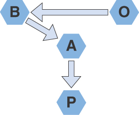

本书中的所有思想都深深地交织在一起。到处都有交叉和冗余。如果不改进模块化，你就无法真正分离关注点。
模块化、内聚和关注点分离增强了我们收集反馈的能力，从而促进了实验。
因此，在本书的学习过程中，我多次循环了这些主题中的每一个。这既是有意的，也是不可避免的，但我也认为它说明了关于这些想法的一些更重要的东西。
这些想法不仅密切相关，而且几乎适用于所有地方，这就是重点。
太容易迷失在昙花一现的细节中。我们选择哪种语言、操作系统、文本编辑器或框架是细节，最终对我们来说应该不如那些可转移到所有这些东西的技能重要。
正如我在别处所说的那样，与我合作过的最好的软件开发人员编写了他们选择应用的任何工具的好软件。当然，他们中的许多人对他们选择的工具拥有深厚的专业知识和技能，但这并不是他们的技能、才能或对雇用他们的组织的价值的核心。
您可能对所有这些想法都很熟悉，但也许您没有将它们视为组织工作的一种方法。这就是我写这本书的意图。我的意思不仅仅是提醒你这些东西就在那里，而是建议你将它们作为你所做的一切背后的驱动原则。
这些想法围绕优化我们所做的一切以最大限度地提高我们学习和管理我们创建的系统的复杂性的能力的原则组织，真正构成了一门学科的基础，我们可以合理地将其称为解决问题的工程方法软件问题。
如果我们做这些事情，我们成功的可能性就比不做的要高。
这不是一种“摇动手柄”的方法。简单地遵循我的或任何其他人的食谱，您不会获得出色的软件，就像遵循一些神话般的点对点汽车制造商手册来制造出色的汽车一样。
这需要你考虑周到、勤奋、谨慎和聪明。软件开发要做好并不是一件容易的事。某些形式的编码可能是，但正如我已经描述的那样，软件开发不仅仅是编码。
这是一个简单的软件工程模型，但很难应用。
很简单，有两组的十个基本思想，然后是一些工具，如可测试性、可部署性、速度、控制变量和持续交付，可以帮助我们实现这些基本思想，仅此而已。然而，这十件事的含义往往发人深省且复杂，以至于难以应用。
掌握这些工具的使用并将这些想法用作支撑我们设计和决策的基本原则，可以增加我们成功的机会。使用它们作为我们对我们创建的软件做出决策的基础在我看来是软件开发学科的核心。
我写这本书的目的不是说“软件很容易”，而是承认“软件很难，所以让我们深思熟虑”。
对我来说，这意味着我们需要更加小心地处理它，在一个思考框架内，使我们能够为我们还没有想到的问题找到更好的答案。这是一种为我们不知道如何解决的问题寻找解决方案的方法。
这十件事给了我这个框架，我看到许多个人和团队从应用它们中受益。
了解我们学科的性质会影响我们取得进步的能力。认识到我们构建的系统的复杂性以及软件本身的本质，对于成功很重要。在编写半线性指令序列时，将其视为微不足道的练习总是注定要失败，但最微不足道的编程练习除外。
我们需要运用可以适应我们面临的任何情况的心理工具。在我看来，这似乎是我们可以认为是真正的软件工程学科的任何事物的核心。

## 作为人类过程的工程
工程这个术语可能很模糊，因为它经常在软件开发的上下文中被误用。
工程学的大多数定义都以“对工程师工作的研究”之类的内容开头，然后继续描述为这项工作提供信息的数学和科学的使用。所以这真的是关于过程，我们的工作方法。
我在本书开头介绍的工作定义对我来说达到了目标。
工程是应用经验的、科学的方法来为实际问题寻找有效、经济的解决方案。

工程是经验性的，因为我们不会试图将科学应用到我们期望每次都能获得完美结果的程度。 （实际上，科学也不是那样工作的；它只是努力接近它。）
工程是关于做出理性决策，通常信息不完整，然后根据我们从现实世界经验收集的反馈，了解我们的想法在现实中如何发挥作用。
它基于科学的推理方式。我们想要衡量我们可以合理衡量的东西。采取实验方法进行更改。控制变量，以便我们了解更改的影响。开发和维护一个模型，一个假设，随着理解的增长，我们可以根据它不断评估我们的理解。
重要的是，我们找到的解决方案以及我们实现这些解决方案的方式是有效的。
我们希望我们创建的系统尽可能简单，并尽可能快地运行，同时消耗成功所需的最少资源。
我们还希望能够以最少的工作量快速创建它们。出于经济原因，这很重要，但如果我们希望能够有效学习，这也至关重要。反馈的及时性是衡量我们工作效率的一个很好的衡量标准。正如我们在第 5 章中探讨的，反馈的及时性也是我们有效学习能力的基础。
除了工程思维对开发的普遍适用性之外，重要的是要认识到我们工作的组织和团队也是信息系统，因此管理复杂性的想法同样适用于这些事情，甚至更多。

## 数字颠覆性组织

企业和商业领袖谈论数字颠覆之类的想法很常见，这意味着数字技术应用于重新构想和颠覆传统企业。想想亚马逊颠覆了零售供应链，特斯拉改变了汽车生产的基本原理，或者优步将出租车服务转变为零工经济。这些想法对传统企业和传统商业思维都具有挑战性。
此类组织的定义特征之一是，它们几乎总是以工程为主导。软件开发不是成本中心或支持功能；这是“生意”。即使是像特斯拉这样的公司，其产品是一种物理设备，也围绕软件理念塑造了自己的组织。
特斯拉是一家持续交付公司，如果有人想到一个新想法，他们可以重新配置工厂，通常是通过软件，应用新想法。
软件正在改变业务的开展方式，为此，它挑战了许多传统假设。
我最喜欢的模型之一来自 Jan Bosch；他将其描述为“BAPO 与 OBAP。”1 图 15.1 和图 15.2 有助于解释他的想法。

图 15.1 大多数企业如何计划 (OBAP)

大多数公司遵循 OBAP 模型（见图 15.1）。他们首先确定组织、部门、团队、职责等。然后，他们根据这些组织决策的约束，决定业务战略以及如何产生收入和利润或其他业务成果。接下来，他们决定一个合适的架构来建立他们的系统，最后决定一个可以交付该系统架构的流程。
这有点疯狂。业务愿景和目标受组织结构的约束。
更明智的模型是将我们的组织结构视为一种工具：BAPO。
我们确定业务愿景和目标，决定我们如何在技术上实现该目标（架构），弄清楚我们如何构建类似的东西（流程），然后选择一个支持必要活动的组织结构。
1. Jan Bosch 在 https://bit.ly/33GBrR1 上的博客文章“Structure Eats Strategy”和他的书速度、数据和生态系统中描述了这些想法。请参阅 https://amzn.to/3x5Ef6T。

图 15.2 企业应如何组织 (BAPO)

当我们开始考虑组织人群作为实现目标的工具的方式时，应用本书中描述的那种工程思维是成功运用该工具的核心。
与任何其他信息系统一样，管理我们组织内的耦合是成功的关键之一。就像软件如此，组织也是如此。模块化、有凝聚力的组织与关注点和团队的合理分离，以允许他们对组织的其他部分隐藏信息的方式进行抽象，比只能在锁定步骤中取得进展的高度耦合的团队更具可扩展性和效率。
这是组织规模化如此困难的原因之一。随着它们的增长，耦合的成本会增加。设计组织以最大限度地减少不同人群之间的耦合是大型、快速发展的公司的现代战略。
Accelerate 一书背后的研究发现，基于稳定性和吞吐量的衡量标准，高绩效团队的定义特征之一是他们可以在团队内部做出决策，而无需寻求许可或协调，这并非偶然与，其他组。这样的团队在信息上是分离的。
这是重要的东西。这就是像亚马逊这样的组织之间的区别，当规模扩大一倍时，生产力会增加一倍以上，而结构更传统的公司在规模扩大时生产力仅提高 85%。 2
2. 微服务一词的发明者 James Lewis 有一个有趣的演讲，涉及到 Santa Fe Institute on Non-Linear Dynamics 的工作。请参阅 https://youtu.be/tYHJgvJzbAk。

## 结果与机制
当我准备撰写本书的结论时，我参与了一场关于结果和机制重要性的在线辩论。我从一个绝对确定的立场开始，每个人都会同意我的观点，即结果比机制更重要。我很快就否定了这个假设。
然而，我不认为我的对话者是愚蠢的，因为他们不同意我的观点。看了他们的回答，我想他们最终同意了我的观点。他们并没有忽视“结果”的重要性；他们担心的是一些他们重视的隐性事物，或者他们喜欢的机制，这些机制帮助他们实现了他们想要的结果。
软件开发的成功结果是一个复杂的想法。有一些显而易见的事情很容易衡量，我们可以从这些事情开始。我们可以衡量某些业务和软件的商业成果；这是衡量成功的标准之一。我们可以衡量使用数量，开源软件项目的成功通常通过软件累积的下载数量来衡量。
我们可以应用 DORA 对生产力和质量、稳定性和吞吐量的衡量，这告诉我们成功的团队可以非常高效地生产非常高质量的软件。我们还可以通过各种指标衡量客户对我们产品的满意度。
所有这些方面的“分数”在某种程度上都是理想的结果。其中一些是上下文相关的，而另一些则不是，并且在任何上下文中有效地进行质量工作（在稳定性和吞吐量方面得分良好）都会比不工作更成功，这就是为什么我认为这些措施是一种如此有效的工具.
我讨论“结果比机制更重要”的背景是关于持续交付作为一种想法与 DevOps 作为一种想法的辩论。 3
我的观点是，我认为持续交付定义了一种理想的结果，而不是一种机制，因此它作为指导开发战略和方法的一般性组织原则更有用。
DevOps 是一个非常有用的实践集合；如果您采用所有实践并做得好，那么您将能够持续将价值交付到您的用户和客户手中。但是，如果由于某种原因出现了 DevOps 范围之外的情况，因为它更多是实践的集合，那么如何应对就不太明显了。
然而，持续交付说“努力使您的软件始终处于可发布状态”、“优化快速反馈”和“我们的目标是将最有效的反馈从想法到有价值的软件交到我们的用户手中。 ”
如果我们认真对待这些想法，我们就可以利用它们为我们以前从未遇到过的问题提出独特的、创新的解决方案。
3. 如果您对我对 CD 与 DevOps 的看法感兴趣，请在我的 YouTube 频道上观看此视频：https://youtu.be/-sErBqZgKGs。

当我和其他人开始编写持续交付时，我们从未制造过汽车、宇宙飞船或电信网络。这些活动中的每一个都对我们在 Jez Humble 和我写这本书时构建的系统类型提出了非常不同的挑战。
当我担任顾问时，我会根据客户的部署管道反馈，就他们应该努力实现的目标和目标向我的客户提供具体建议。我通常建议我的客户在提交阶段的五分钟内获得结果，整个管道在不到一小时的时间内完成。 “旨在每小时创造一些可发布的东西。”
如果你是特斯拉制造汽车或 SpaceX 制造火箭或爱立信建设全球移动电话基础设施，这可能是不可能的，因为燃烧硅或用金属制造东西的物理学会阻碍。
但是，持续交付的原则仍然成立。
“努力使您的软件始终可发布。”您仍然可以彻底测试您的软件，如果单个测试失败，则立即拒绝任何更改。 “优化快速反馈。”自动化一切：自动化测试以在模拟中进行绝大多数测试，以便反馈始终快速有效。
比这更深刻的是，我们可以从科学中汲取的思想，持续交付所依据的思想，是最持久的。

- 表征：观察当前状态。
- 假设：创建一个描述，一个可以解释你的观察的理论。
- 预测：根据您的假设进行预测。
- 实验：测试你的预测。

为了理解我们从这种方法中学到的东西，我们必须控制变量。我们可以通过几种不同的方式来做到这一点。我们可以分步进行，以便了解每一步的影响。我们可以对系统的配置进行完全控制，并使用我们讨论过的管理复杂性的技术来限制更改的范围。
这就是我所说的工程——给我们明显更高的成功机会的想法、方法和工具。
您可能无法达到我通常推荐的反馈目标，但您可以将它们用作目标，并在物理或经济限制下朝着这些目标努力。

## 耐用且普遍适用
如果我们成功地定义了软件开发的工程学科，那么它将与技术无关。它所依据的原则将是持久和有用的，帮助我们回答我们没有预见到的问题，并帮助我们理解我们尚未发明的想法和技术。
我们可以试试这个！
我的职业生涯一直在开发我和我的同事设计的软件，但我们可以将这种思维应用于不同形式的软件开发吗？这些工程原理是否仍然适用于机器学习 (ML)？
图 15.3 显示了一个典型的 ML 工作流程。时间花在组织训练数据、清理数据和准备使用上。选择合适的机器学习算法，定义适应度函数以应用于输入数据，然后在训练数据上释放 ML 算法。他们循环尝试解决问题的不同解决方案，直到达到与适应度函数匹配的所需精度。此时，生成的算法可以部署到生产中。

图 15.3 典型的机器学习工作流程

如果没有达到准确度，这个过程会随着开发人员/数据科学家改变训练数据和适应度函数而循环，以尝试找到一个有效的解决方案。
一旦算法投入生产，就可以对其进行监控，如果发现任何问题，则可以返回到循环中重新训练。
我们的工程模型如何适合？
显然，机器学习系统的开发完全是为了学习，而不仅仅是为了机器。开发人员需要优化他们的工作和方法，让他们了解使用哪些数据来训练他们的系统，以及哪些在健身功能中起作用来指导训练。
训练机器学习系统涉及大量数据，因此思考并积极采用技术来管理这种复杂性对于取得良好进展至关重要。有人告诉我，数据科学家很容易迷失在数据的泥沼中并且无法取得可重复的进展。
开发过程本身显然将作为迭代过程发挥最佳作用。训练数据的组装和准备以及合适的适应度函数的建立和改进基本上是迭代过程。反馈以与适应度函数匹配的准确性的形式提供。显然，当迭代很短并且反馈快速而清晰时，这将最有效。整个过程是一个实验迭代和细化的过程。
以这种方式思考它使我们有机会做得更好。优化过程是明智的，这样开发人员可以快速循环，以提高每次迭代的学习质量。这意味着以更小的步骤工作，并清楚反馈的性质和质量。
把每一个小步骤都当作实验来考虑鼓励我们更好地控制变量，例如版本控制我们的脚本和训练数据。
甚至想象这个过程的这一部分被计划和工作在一个动态的、迭代的、反馈驱动的经验发现过程之外，似乎有点奇怪。
为什么是经验主义？因为数据很混乱，而且结果足够复杂，在 ML 开发中通常使用的控制级别上没有确定性。
这提出了另一个有趣的问题。你能行使更多的控制权吗？我与 ML 专家进行了有趣的对话。他质疑我的简单图片（参见图 15.3）。 “监控是什么意思？我们怎么可能知道结果？”
好吧，如果我们采用工程方法，那么我们会将我们的模型发布到生产中作为实验。如果是实验，那么我们正在做出某种预测，需要测试我们的预测。在我们创建 ML 系统时，我们可以想象描述我们正在尝试做什么。我们可以预测我们可能期望看到的结果。这不仅仅是适应度函数。这更像是定义一些错误界限，一个范围，我们希望合理的答案落在这个范围内。
如果我们的 ML 系统旨在销售更多书籍，那么如果答案漂移到“试图接管世界”的领域，它可能不会做得很好。
如何管理复杂性？嗯，机器学习的问题之一是，做这件事的人通常没有软件背景。因此，许多已成为软件开发常态的技术——即使是像版本控制这样的基本技术——都不是常态。
然而，很容易看出可以应用本书中的工程原理的方法。采用模块化方法编写汇编脚本、清理数据和定义适应度函数是显而易见的。这是代码，所以使用必要的工具让我们能够编写好的代码。控制变量，用内聚力将相关的想法紧密地联系在一起，并通过模块化、关注点分离、抽象和减少耦合将不相关的想法分开。不过，这对于所涉及的数据也是如此。
将这些想法应用于数据并选择模块化的训练数据（从某种意义上说，它专注于问题的正确方面）允许 ML 系统的开发人员更快地迭代。这限制了更改并专注于训练过程，并且可能有助于采用更有效、更具可扩展性的方法来管理训练数据。这是对数据清理真正含义的一种看法。
确保数据和适应度函数中的关注点分离也很重要。您可以明智地将诸如 ML 系统根据经济环境和族群或工资和性别等因素之间的内置“假设”做出错误决策之类的问题视为表示训练数据中关注点分离不佳的问题，以及一个悲伤的陈述在我们的社会。
在我暴露我对机器学习的更多无知之前，我将就此打住。我的观点是，如果这些心理工具普遍适用，它们将为我们提供解决问题的有用方法，即使我们对它们一无所知。
在我的示例中，我并没有声称我得出了任何正确的答案，但是我的模型允许我提出一些问题，据我所知，这些问题在 ML 圈子中并不常见。它们是我们可以调查的问题，并且可能帮助我们优化流程，提高 ML 系统的生产质量，甚至改进系统本身。
这是我们应该从真正的工程过程中得到的期望。它不会给我们答案，但会为我们提供一种方法，引导我们找到更好的答案。

## 工程学科的基础
本书中的思想构成了工程学科的基础，可以扩大我们成功的机会。
您选择的编程语言并不重要。你使用的框架并不重要。你选择的方法比我在本书中概述的想法更重要。
并不是这些其他事情与我们的工作无关；他们是这样。它们的重要性与木匠选择挥舞的锤子型号有关。
对于软件而言，这种选择不仅仅是个人偏好，因为它会影响团队的合作方式，但本质上，选择一种技术而不是另一种技术对结果的影响小于该技术的应用方式。
我写这本书的目的是描述一些想法，这些想法通常为我们提供如何更有效地使用我们的工具的指导。
通过专注于优化学习和管理复杂性的基础，我们增加了成功的机会，无论我们选择使用什么技术。

## 概括

多年来，本书中的思想构成了我的软件开发方法的基础。不可避免地，编写本书的过程帮助我以一种我希望能够更容易地将它们与其他人交流的方式具体化了我的想法。
在我职业生涯的后期，我几乎只从事复杂系统的工作。我很幸运能够解决一些以前很少有人（如果有的话）解决的问题。每当我和我的团队陷入困境时，这些就是我们求助的基础。无论问题的性质如何，即使我们对如何取得进展一无所知，它们也可以作为引导我们取得更好结果的指南。
这些天，我主要为大型跨国公司提供咨询谋生，经常做创新的事情，有时规模空前。这些想法仍然适用，并指导我们解决真正困难的问题。
当我开始为自己编写代码时，仍然是我非常喜欢的事情，我将这些相同的想法应用到最小且通常是最简单的规模上。
如果你总是优化你的工作以及你如何进行它以最大限度地提高你有效学习的能力，你会做得更好。
如果你总是在各种规模上努力管理你面前工作的复杂性，你将能够无限期地保持你做得更好的能力。
这些是真正的软件开发工程学科的标志。当我们应用该原则时，我们会显着提高更快地构建更好软件的机会。
这里有一些重要和有价值的东西。我希望我能够以一种您会发现对您的工作有所帮助的方式来表达它。

